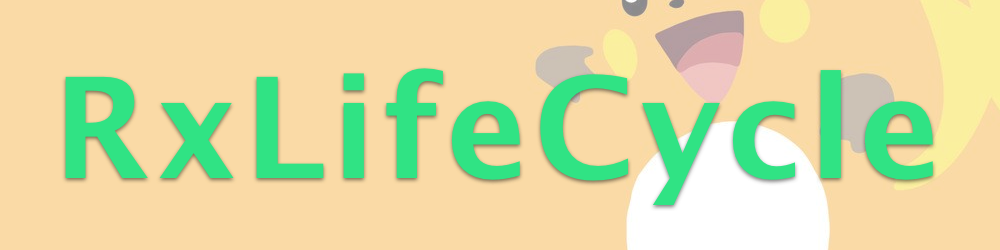

# RxLifeCycle

[](http://cocoadocs.org/docsets/RxLifeCycle)
[](https://github.com/Carthage/Carthage)
[](http://cocoadocs.org/docsets/RxLifeCycle)
[](http://cocoadocs.org/docsets/RxLifeCycle)




## Description

If you're using `MVVM` with `FRP`, then chances are that you need to rely on `UIViewController` or `UIApplication` life cycle events to trigger signals. We can either do it by calling a method on the `ViewModel`, like [kickstarter-ios](https://github.com/kickstarter/ios-oss/blob/2b41cfed6a835d7edf34db95c925f7232c17c558/Kickstarter-iOS/Views/Controllers/LoginViewController.swift)

```swift
override func viewWillAppear(_ animated: Bool) {
  super.viewWillAppear(animated)
  self.viewModel.inputs.viewWillAppear()
}
```

or reactively using signal binding.

```swift
override func viewDidLoad() {
  super.viewDidLoad()
  rx.viewWillAppear.bind(to: viewModel.input.fetchData).disposed(by: disposeBag)
}
```

One way to make observations for the life cycle is to use [sentMessage](https://github.com/ReactiveX/RxSwift/blob/f043778214c8f182018ccdfbf7f440edbe0aecc8/RxCocoa/Foundation/NSObject%2BRx.swift#L136) which involves a lot of swizzlings  😱 We shouldn't use swizzlings, it is just asking [for](https://github.com/ReactiveX/RxSwift/issues/1288) [problem](https://blog.newrelic.com/2014/04/16/right-way-to-swizzle/).

Instead, we can just use simple composition, that you can plug and play everywhere you want. See [demo](https://github.com/onmyway133/RxLifeCycle/tree/master/Example/RxLifeCycleDemo)

## Features

- `ViewControllerLifeCycle` for events related to `UIViewController`
- `AppLifeCycle` for events related to `UIApplication`, equivalent to `UIApplicationDelegate`
- Auto clean up upon deinit
- Support iOS, tvOS

## Usage

### ViewControllerLifeCycle

This works by embed a child view controller so that it can forward [appearance method](https://developer.apple.com/library/content/featuredarticles/ViewControllerPGforiPhoneOS/ImplementingaContainerViewController.html)

> After adding a child to a container, the container automatically forwards appearance-related messages to the child

All you need to do is to declare `ViewControllerLifeCycle` object and observe on it. Remember to keep this `ViewControllerLifeCycle` so it is not released !!

```swift
let viewController = LoginViewController()
let lifeCycle = ViewControllerLifeCycle(viewController: viewController)

_ = lifeCycle.viewWillAppear.subscribe(onNext: {
  print("viewWillAppear has been called")
})
```

For convenience, you can also use it directly by using `rxLifeCycle`

```swift
let viewController = LoginViewController()

_ = viewController.rxLifeCycle.viewDidAppear.subscribe(onNext: {
  print("viewDidAppear has been called")
})
```

Supported observables

- viewWillAppear
- viewDidAppear
- viewWillDisappear
- viewDidDisappear

### AppLifeCycle

There are times we need to refresh data when user go back to the app again, which is the `UIApplicationWillEnterForeground` event. All you need to do is to declare `AppLifeCycle` and observe on it. Under the hood, it listens to `UIApplication` notifications and publish the signals.

Remember to keep this `AppLifeCycle` so it is not released !!

```swift
let lifeCycle = AppLifeCycle()
_ = lifeCycle.didBecomeActive.subscribe(onNext: {
  print("didBecomeActive was called")
})
```

For convenience, you can also use it directly by using `rxLifeCycle` on `UIApplication`

```swift
let lifeCycle = AppLifeCycle()
_ = UIApplication.shared.rxLifeCycle.willEnterForeground.subscribe(onNext: {
  print("willEnterForeground was called")
})
```

Supported observables

- didBecomeActive
- willResignActive
- didEnterBackground
- willEnterForeground

## Installation

**RxLifeCycle** is available through [CocoaPods](http://cocoapods.org). To install
it, simply add the following line to your Podfile:

```ruby
pod 'RxLifeCycle'
```

**RxLifeCycle** is also available through [Carthage](https://github.com/Carthage/Carthage).
To install just write into your Cartfile:

```ruby
github "onmyway133/RxLifeCycle"
```

**RxLifeCycle** can also be installed manually. Just download and drop `Sources` folders in your project.

## Author

Khoa Pham, onmyway133@gmail.com

## Contributing

We would love you to contribute to **RxLifeCycle**, check the [CONTRIBUTING](https://github.com/onmyway133/RxLifeCycle/blob/master/CONTRIBUTING.md) file for more info.

## License

**RxLifeCycle** is available under the MIT license. See the [LICENSE](https://github.com/onmyway133/RxLifeCycle/blob/master/LICENSE.md) file for more info.
